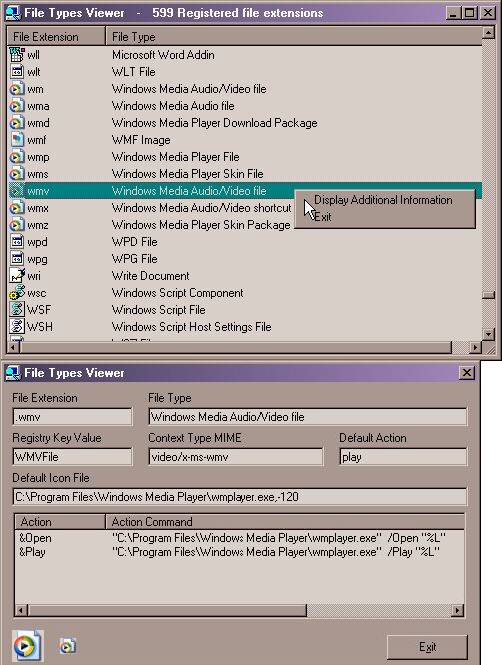



## File Types Example

### Description

File Types Example retrieves all registered file extensions

from the Windows registry and presents them along with the

file types and default icon. Right-Click on the file extension

to view the file types key, content type, default icon file

and the file types actions, also, you can backup the registry

entries in a .reg file.
 
### More Info
 
Windows registry.

This program doesn't alter the Window Registry,

it only reads and displays items.

All registered file extensions.

             |
---                |---
**Submitted On**   |2004-01-18 20:14:54
**By**             |[dlsoftware](https://github.com/Planet-Source-Code/PSCIndex/blob/master/ByAuthor/dlsoftware.md)
**Level**          |Intermediate
**User Rating**    |5.0 (25 globes from 5 users)
**Compatibility**  |VB 5\.0, VB 6\.0
**Category**       |[Registry](https://github.com/Planet-Source-Code/PSCIndex/blob/master/ByCategory/registry__1-36.md)
**World**          |[Visual Basic](https://github.com/Planet-Source-Code/PSCIndex/blob/master/ByWorld/visual-basic.md)
**Archive File**   |[File\_Types1696321182004\.zip](https://github.com/Planet-Source-Code/dlsoftware-file-types-example__1-39793/archive/master.zip)

### API Declarations

In zip file.

